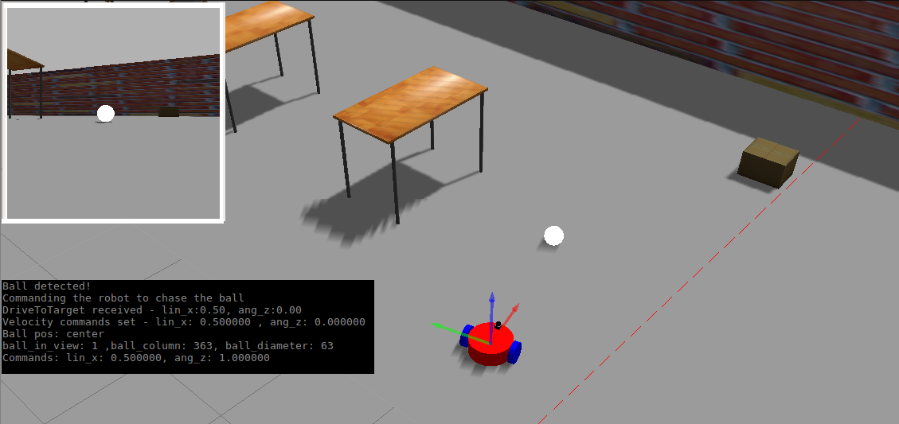

## Project Description



There are two ROS packages `catkin_ws/src`: my_robot and the ball_chaser.

1. `my_robot`: my_robot ROS package contains the robot, the white ball, and the world.
The robot is a differential drive robot defined with the Unified Robot Description Format and is equipped with a lidar and a camera. 
The world.launch launches the world with the white-colored ball and your robot.

2. `ball_chaser`: ball_chaser ROS package contains two nodes: drive_bot and process image. The ball_chaser.launch runs both the drive_bot and the process_image nodes. 

	-  `drive_bot` node provides a ball_chaser/command_robot service to drive the robot by controlling its linear x and angular z velocities.  The service publishes to the wheel joints and returns back the requested velocities.

	-  `process_image` node  reads  robot’s camera image, analyzes it to determine the presence, position and the diameter of a white ball. If a white ball exists in the image, the node should request a service via a client to drive the robot towards it. If the ball occupies more than 75% of the image, the robot stops. In this project, OpenCV was not allowed and the instructions were to divide the image frame into three segments: left, center, right and assign velocity commands based on the position of the ball. 


## Prerequisites/Dependencies
* Linux 16.04
* Gazebo >= 7.0  
* ROS Kinetic  
* make >= 4.1
* gcc/g++ >= 5.4

## Instructions 
After creating a catkin workspac and running catkin_make:

1. Launch the robot inside your world
```bash

	$ cd ~/catkin_ws/
	$ source devel/setup.bash
	$ roslaunch my_robot world.launch
```

2. Run drive_bot and process_image
```bash
	$ cd ~/catkin_ws/
	$ source devel/setup.bash
	$ roslaunch ball_chaser ball_chaser.launch
```

3. Visualize
```bash
	$ cd ~/catkin_ws/
	$ source devel/setup.bash
	$ rosrun rqt_image_view rqt_image_view  
```


```
  catkin_ws/src                        # Go Chase It Project
    ├── my_robot                       # my_robot package                   
    │   ├── launch                     # launch folder for launch files   
    │   │   ├── robot_description.launch
    │   │   ├── world.launch
    │   ├── meshes                     # meshes folder for sensors
    │   │   ├── hokuyo.dae
    │   ├── urdf                       # urdf folder for xarco files
    │   │   ├── my_robot.gazebo
    │   │   ├── my_robot.xacro
    │   ├── world                      # world folder for world files
    │   │   ├── name_world.world
    │   ├── CMakeLists.txt             # compiler instructions
    │   ├── package.xml                # package info
    ├── ball_chaser                    # ball_chaser package                   
    │   ├── launch                     # launch folder for launch files   
    │   │   ├── ball_chaser.launch
    │   ├── src                        # source folder for C++ scripts
    │   │   ├── drive_bot.cpp
    │   │   ├── process_images.cpp
    │   ├── srv                        # service folder for ROS services
    │   │   ├── DriveToTarget.srv
    │   ├── CMakeLists.txt             # compiler instructions
    │   ├── package.xml                # package info                  
    └──                              
```